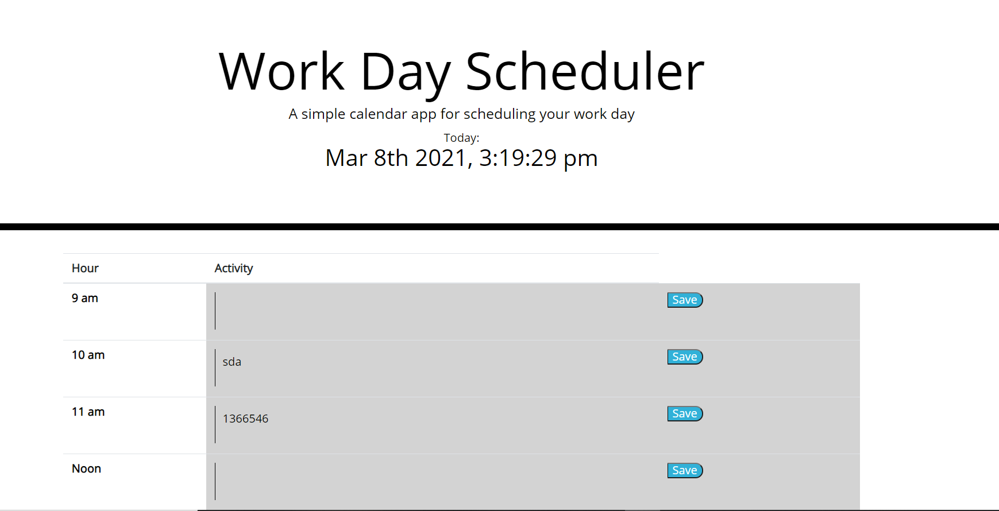
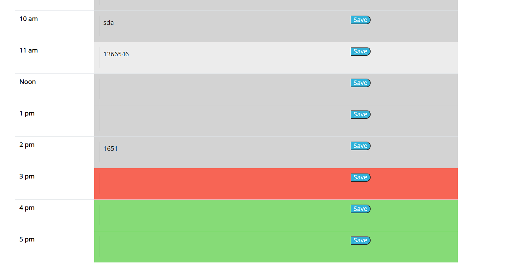

# dayPlanner

Acceptance Criteria:

GIVEN I am using a daily planner to create a schedule

-WHEN I open the planner
THEN the current day is displayed at the top of the calendar

WHEN I scroll down
THEN I am presented with timeblocks for standard business hours

WHEN I view the timeblocks for that day
THEN each timeblock is color coded to indicate whether it is in the past, present, or future

WHEN I click into a timeblock
THEN I can enter an event

WHEN I click the save button for that timeblock
THEN the text for that event is saved in local storage
WHEN I refresh the page
THEN the saved events persist

I was trying to get a .each loop to work but was unable to do so successfully so I turn to get writing out each function and was able to get the site to work as directed.

Live site: https://ericmalpass.github.io/dayPlanner/

Repo : https://github.com/EricMalpass/dayPlanner

I recieve alot of support from my study group, tutur, askbcs tuturs, and various websites: 

Study Group:

-Li Hua Anderson

-Sam Oberg

-Kelly Dean Mahaffey

Tutur

-Quint Turner

Websites:
https://api.jquery.com/jquery.each/

https://momentjs.com/

https://jqueryui.com/

https://getbootstrap.com/

https://www.w3schools.com/

https://developer.mozilla.org/en-US/
